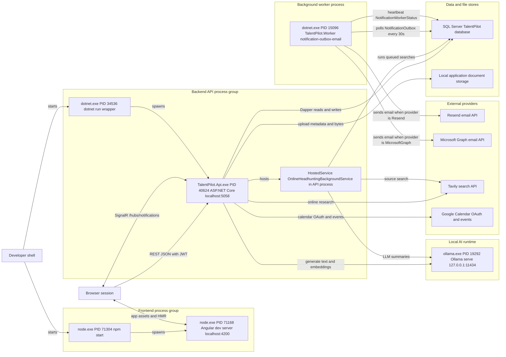
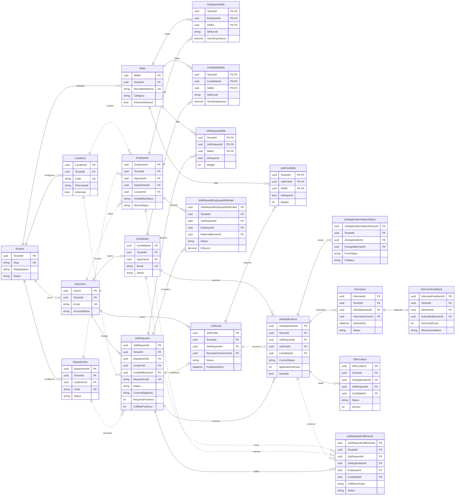

# Talent Pilot ERD and System Design Diagrams

Generated on June 5, 2026 from the current frontend, backend, worker, SQL schema, and local runtime process state.

## Sources Checked

- `Application Code/Frontend Code/package.json`
- `Application Code/Frontend Code/src/app/core/services/configuration.service.ts`
- `Application Code/Frontend Code/src/app/core/services/realtime-notification.service.ts`
- `Application Code/Backend Code/src/TalentPilot.Api/Program.cs`
- `Application Code/Backend Code/src/TalentPilot.Api/Background/OnlineHeadhuntingBackgroundQueue.cs`
- `Application Code/Backend Code/src/TalentPilot.Worker/Program.cs`
- `Application Code/Backend Code/src/TalentPilot.Worker/Worker.cs`
- `Application Code/Backend Code/src/TalentPilot.Api/appsettings.json`
- `Application Code/Backend Code/scripts/schema/*.sql`
- `Application Code/Backend Code/scripts/migrations/*.sql`

## Current Local Process Count

Observed local runtime processes:

| Process | PID | Role | Listener |
| --- | ---: | --- | --- |
| `node.exe` | 71304 | `npm start` wrapper for frontend | none |
| `node.exe` | 71168 | Angular dev server, `ng serve --host localhost --port 4200` | `localhost:4200` |
| `dotnet.exe` | 34536 | `dotnet run` wrapper for API | none |
| `TalentPilot.Api.exe` | 40624 | ASP.NET Core API host | `localhost:5058` |
| `dotnet.exe` | 15096 | `TalentPilot.Worker` notification outbox worker | none |
| `ollama.exe` | 19292 | Ollama local AI runtime | `127.0.0.1:11434` |

The API process also hosts `OnlineHeadhuntingBackgroundService` in-process. It is not a separate OS process; it consumes an in-memory bounded `Channel` inside `TalentPilot.Api.exe`.

## Diagram 1: Runtime Process Topology

## Diagram 2: System Design and Communication

```mermaid
flowchart LR
    subgraph clients["Clients"]
        internalUser["Internal users"]
        candidateUser["Candidate portal users"]
        browserApp["Angular SPA"]
    end

    subgraph frontend["Frontend application"]
        routeGuards["Route guards"]
        featureComponents["Feature components"]
        stores["Feature stores and services"]
        apiService["ApiService"]
        authInterceptor["Auth token interceptor"]
        signalrClient["RealtimeNotificationService"]
    end

    subgraph backend["ASP.NET Core API"]
        authController["AuthController api/auth"]
        adminControllers["Admin Center controllers"]
        operationsController["OperationsController api/talent-pilot"]
        aiAssistantController["AiAssistantController"]
        calendarController["GoogleCalendarController"]
        notificationsHub["NotificationsHub SignalR"]
        appServices["Application services"]
        aiAgents["Code-owned AI agents"]
        onlineQueue["Online headhunting in-memory Channel"]
        onlineHosted["OnlineHeadhuntingBackgroundService"]
        realtimePublisher["SignalR realtime publisher"]
    end

    subgraph infrastructure["Infrastructure layer"]
        dapperRepos["Dapper repositories"]
        tokenServices["JWT and refresh token services"]
        ollamaProvider["Ollama model and embedding providers"]
        webResearchProvider["Tavily web research provider"]
        emailProviderResolver["Tenant email provider resolver"]
        documentStorage["Application document storage provider"]
    end

    subgraph storesExternal["Stores and providers"]
        sqlDb["SQL Server database with VECTOR(768)"]
        localFiles["Local filesystem document store"]
        ollamaRuntime["Ollama localhost:11434"]
        tavilyApi["Tavily API"]
        googleApi["Google Calendar API"]
        emailApis["Resend or Microsoft Graph email"]
    end

    subgraph workers["Workers"]
        notificationWorker["TalentPilot.Worker"]
    end

    internalUser -->|"uses"| browserApp
    candidateUser -->|"uses"| browserApp
    browserApp -->|"activates"| routeGuards
    browserApp -->|"renders"| featureComponents
    featureComponents -->|"call methods"| stores
    stores -->|"HTTP paths"| apiService
    apiService -->|"adds base URL"| authInterceptor
    authInterceptor -->|"REST JSON"| authController
    authInterceptor -->|"REST JSON"| adminControllers
    authInterceptor -->|"REST JSON"| operationsController
    authInterceptor -->|"REST JSON"| aiAssistantController
    authInterceptor -->|"REST JSON"| calendarController
    signalrClient <-->|"access token + NotificationReceived"| notificationsHub

    authController -->|"login refresh logout me"| appServices
    adminControllers -->|"tenant admin use cases"| appServices
    operationsController -->|"recruiting workflow use cases"| appServices
    aiAssistantController -->|"RAG chat and indexing"| appServices
    calendarController -->|"OAuth and event creation"| appServices
    appServices -->|"repositories"| dapperRepos
    appServices -->|"token issue verify revoke"| tokenServices
    appServices -->|"draft parse rank explain recommend"| aiAgents
    appServices -->|"queue search job"| onlineQueue
    onlineQueue -->|"dequeue inside API"| onlineHosted
    appServices -->|"persist realtime notification"| realtimePublisher
    realtimePublisher -->|"push tenant-user group"| notificationsHub

    dapperRepos -->|"SQL queries and transactions"| sqlDb
    tokenServices -->|"credentials refresh tokens"| sqlDb
    aiAgents -->|"model generation and embeddings"| ollamaProvider
    aiAgents -->|"guarded web search"| webResearchProvider
    onlineHosted -->|"runs same operations service"| appServices
    documentStorage -->|"file bytes"| localFiles
    appServices -->|"document metadata"| dapperRepos
    ollamaProvider -->|"HTTP /api/generate /api/embeddings"| ollamaRuntime
    webResearchProvider -->|"quota-controlled search"| tavilyApi
    calendarController -->|"OAuth callback and event POST"| googleApi
    appServices -->|"queue email rows"| sqlDb
    notificationWorker -->|"claim pending outbox rows"| sqlDb
    notificationWorker -->|"resolve tenant provider"| emailProviderResolver
    emailProviderResolver -->|"read provider setting"| sqlDb
    notificationWorker -->|"send email"| emailApis
```

## Diagram 3: Core Recruiting ERD

This ERD keeps only the key columns needed to understand relationships. The executable schema remains the SQL source of truth.

## Diagram 4: Identity, Workflow, Notifications, and AI ERD

Polymorphic tables such as `VectorEmbeddings`, `AiAgentRuns`, `AiRecommendationLogs`, and notification entity references store `EntityType` plus `EntityId`. The hard SQL foreign keys are shown where they exist; polymorphic entity links are intentionally not drawn as physical FKs.

```mermaid
erDiagram
    direction LR
    Tenants ||--o| TenantRecruitmentSettings : has
    Tenants ||--o| TenantAiSettings : has
    Tenants ||--o{ AppUsers : owns
    AppUsers ||--o| UserCredentials : authenticates
    AppUsers ||--o{ RefreshTokens : sessions
    Tenants ||--o{ Roles : defines
    Roles ||--o{ RolePermissions : grants
    Permissions ||--o{ RolePermissions : assigned
    AppUsers ||--o{ UserRoles : receives
    Roles ||--o{ UserRoles : assigned
    Tenants ||--o{ Groups : routes
    Groups ||--o{ GroupMembers : includes
    AppUsers ||--o{ GroupMembers : member
    Tenants ||--o{ WorkflowDefinitions : owns
    WorkflowDefinitions ||--o{ WorkflowStages : contains
    WorkflowDefinitions ||--o{ WorkflowTransitions : contains
    WorkflowStages ||--o{ WorkflowTransitions : from_stage
    WorkflowStages ||--o{ WorkflowTransitions : to_stage
    WorkflowTransitions ||--o| WorkflowRoutingRules : routes
    WorkflowDefinitions ||--o{ WorkflowAssignments : creates
    WorkflowStages ||--o{ WorkflowAssignments : current
    WorkflowTransitions ||..o{ WorkflowAssignments : generated
    AppUsers ||..o{ WorkflowAssignments : assigned
    Groups ||..o{ WorkflowAssignments : assigned
    Roles ||..o{ WorkflowAssignments : assigned
    WorkflowAssignments ||--o{ WorkflowHistory : records
    AppUsers ||..o{ WorkflowHistory : acts
    Tenants ||--o{ NotificationEvents : defines
    NotificationEvents ||--o{ NotificationTemplates : templates
    NotificationEvents ||--o{ NotificationRecipients : persists
    AppUsers ||--o{ NotificationRecipients : receives
    NotificationEvents ||--o{ NotificationOutbox : queues
    NotificationTemplates ||..o{ NotificationOutbox : renders
    AppUsers ||..o{ NotificationOutbox : recipient
    AiAgentDefinitions ||--o{ AiAgentRuns : executes
    Tenants ||--o{ AiAgentRuns : logs
    Tenants ||--o{ VectorEmbeddings : indexes
    AiAgentDefinitions ||..o{ AiRecommendationLogs : explains
    AiAgentRuns ||..o{ AiRecommendationLogs : produced
    Tenants ||--o{ KnowledgeChunks : indexes
    AppUsers ||--o{ AiAssistantConversations : starts
    AiAssistantConversations ||--o{ AiAssistantMessages : contains
    AiAgentRuns ||..o{ AiAssistantMessages : backs
    AiAssistantMessages ||--o{ AiAssistantMessageCitations : cites
    KnowledgeChunks ||--o{ AiAssistantMessageCitations : cited
    AiAssistantMessages ||--o{ AiAssistantFeedback : rated
    Tenants ||--o{ OnlineCandidateSourcingRuns : owns
    AiAgentRuns ||..o{ OnlineCandidateSourcingRuns : backs
    OnlineCandidateSourcingRuns ||--o{ OnlineCandidateLeads : returns
    Tenants ||--o{ GoogleCalendarConnections : connects
    AppUsers ||--o{ GoogleCalendarConnections : organizer

    Tenants {
        uuid TenantId PK
        string Slug UK
        string Status
    }
    TenantRecruitmentSettings {
        uuid TenantId PK, FK
        string CareerDisplayName
        string NotificationEmailProvider
        int InviteExpiryDays
        int ReapplyCooldownDays
    }
    TenantAiSettings {
        uuid TenantId PK, FK
        string ProviderMode
        string LlmModel
        string EmbeddingModel
        int EmbeddingDimensions
        bool HumanReviewRequired
    }
    AppUsers {
        uuid UserId PK
        uuid TenantId FK
        string Email UK
        string AccountStatus
    }
    UserCredentials {
        uuid UserCredentialId PK
        uuid TenantId FK
        uuid UserId FK, UK
        string PasswordHash
    }
    RefreshTokens {
        uuid RefreshTokenId PK
        uuid TenantId FK
        uuid UserId FK
        string TokenHash UK
        datetime ExpiresAtUtc
    }
    Roles {
        uuid RoleId PK
        uuid TenantId FK
        string Code UK
        string Scope
        int Priority
    }
    Permissions {
        string PermissionId PK
        string GroupName
        string Status
    }
    RolePermissions {
        uuid RoleId PK, FK
        string PermissionId PK, FK
    }
    UserRoles {
        uuid TenantId PK, FK
        uuid UserId PK, FK
        uuid RoleId PK, FK
    }
    Groups {
        uuid GroupId PK
        uuid TenantId FK
        string Purpose
        string Name
        string Status
    }
    GroupMembers {
        uuid TenantId PK, FK
        uuid GroupId PK, FK
        uuid UserId PK, FK
        bool IsDefaultAssignee
    }
    WorkflowDefinitions {
        uuid WorkflowDefinitionId PK
        uuid TenantId FK
        string Code UK
        string EntityType
        string Status
    }
    WorkflowStages {
        uuid WorkflowStageId PK
        uuid TenantId FK
        uuid WorkflowDefinitionId FK
        string StageKey UK
        int StageOrder
        bool IsTerminal
    }
    WorkflowTransitions {
        uuid WorkflowTransitionId PK
        uuid TenantId FK
        uuid WorkflowDefinitionId FK
        uuid FromStageId FK
        uuid ToStageId FK
        string ActionKey UK
    }
    WorkflowRoutingRules {
        uuid WorkflowRoutingRuleId PK
        uuid TenantId FK
        uuid WorkflowTransitionId FK, UK
        string AssignmentType
        uuid TargetUserId FK
        uuid TargetGroupId FK
        uuid TargetRoleId FK
    }
    WorkflowAssignments {
        uuid WorkflowAssignmentId PK
        uuid TenantId FK
        uuid WorkflowDefinitionId FK
        uuid WorkflowStageId FK
        uuid EntityId
        string EntityType
        string AssignmentStatus
    }
    WorkflowHistory {
        uuid WorkflowHistoryId PK
        uuid TenantId FK
        uuid WorkflowAssignmentId FK
        uuid ActorUserId FK
        string ActionKey
        datetime CreatedAtUtc
    }
    NotificationEvents {
        uuid NotificationEventId PK
        uuid TenantId FK
        string EventCode UK
        string DefaultRecipientType
        string Status
    }
    NotificationTemplates {
        uuid NotificationTemplateId PK
        uuid TenantId FK
        uuid NotificationEventId FK
        string Subject
        string Status
    }
    NotificationRecipients {
        uuid NotificationRecipientId PK
        uuid TenantId FK
        uuid NotificationEventId FK
        uuid RecipientUserId FK
        string EntityType
        uuid EntityId
        datetime ReadAtUtc
    }
    NotificationOutbox {
        uuid NotificationOutboxId PK
        uuid TenantId FK
        uuid NotificationEventId FK
        uuid NotificationTemplateId FK
        uuid RecipientUserId FK
        string Channel
        string Status
        int AttemptCount
    }
    NotificationWorkerStatus {
        string WorkerName PK
        string Status
        string HostName
        int ProcessId
        datetime LastHeartbeatUtc
    }
    AiAgentDefinitions {
        string AiAgentDefinitionId PK
        string DisplayName
        bool Enabled
    }
    AiAgentRuns {
        uuid AiAgentRunId PK
        uuid TenantId FK
        string AiAgentDefinitionId FK
        string SourceEntityType
        uuid SourceEntityId
        string ModelName
        string Status
    }
    VectorEmbeddings {
        uuid VectorEmbeddingId PK
        uuid TenantId FK
        string EntityType
        uuid EntityId
        string SourceType
        int EmbeddingDimensions
        bool IsActive
    }
    AiRecommendationLogs {
        uuid AiRecommendationLogId PK
        uuid TenantId FK
        string AiAgentDefinitionId FK
        uuid AiAgentRunId FK
        string SourceEntityType
        uuid SourceEntityId
        decimal Score
    }
    KnowledgeChunks {
        uuid KnowledgeChunkId PK
        uuid TenantId FK
        string ContextType
        uuid ContextEntityId
        string SourceEntityType
        uuid SourceEntityId
        bool IsActive
    }
    AiAssistantConversations {
        uuid ConversationId PK
        uuid TenantId FK
        uuid UserId FK
        string ContextType
        uuid ContextEntityId
        string Status
    }
    AiAssistantMessages {
        uuid MessageId PK
        uuid TenantId FK
        uuid ConversationId FK
        uuid AiAgentRunId FK
        string Role
        string ModelName
    }
    AiAssistantMessageCitations {
        uuid CitationId PK
        uuid TenantId FK
        uuid MessageId FK
        uuid KnowledgeChunkId FK
        decimal Score
    }
    AiAssistantFeedback {
        uuid FeedbackId PK
        uuid TenantId FK
        uuid MessageId FK
        uuid UserId FK
        string Rating
    }
    OnlineCandidateSourcingRuns {
        uuid OnlineCandidateSourcingRunId PK
        uuid TenantId FK
        uuid JobRequestId FK
        uuid JobPostId FK
        uuid RequestedByUserId FK
        uuid AiAgentRunId FK
        string SearchStatus
    }
    OnlineCandidateLeads {
        uuid OnlineCandidateLeadId PK
        uuid OnlineCandidateSourcingRunId FK
        uuid TenantId FK
        uuid JobRequestId FK
        uuid ConvertedCandidateId FK
        uuid ConvertedJobApplicationId FK
        string Status
        decimal MatchScore
    }
    GoogleCalendarConnections {
        uuid GoogleCalendarConnectionId PK
        uuid TenantId FK
        uuid OrganizerUserId FK
        string Provider
        string Status
    }
```

## Operational Notes

- The frontend calls the backend directly at `http://localhost:5058/api` when served from `localhost:4200`.
- SignalR uses the same backend host without `/api`: `http://localhost:5058/hubs/notifications`.
- `TalentPilot.Worker` is required for email delivery. It has no inbound port and polls SQL `NotificationOutbox`.
- Online headhunting is asynchronous, but it uses an in-memory channel inside the API process, not a durable external queue.
- Ollama is local and HTTP-based. The backend calls `/api/generate` for LLM text and `/api/embeddings` for vector embeddings.
- SQL Server is the primary source of truth for tenant data, workflow assignments, candidate/application records, notifications, AI logs, RAG chunks, and `VECTOR(768)` embeddings.

