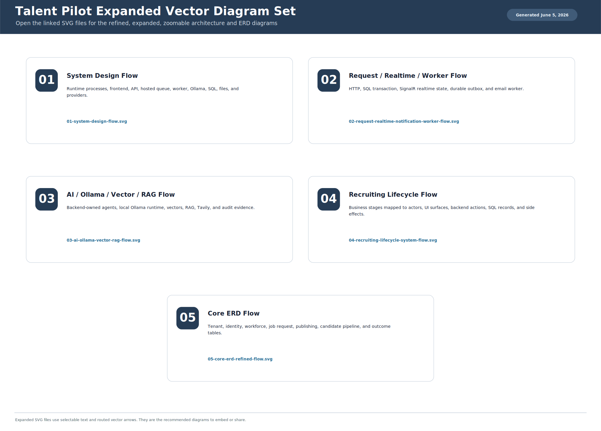

# Refined System Design Diagrams - SVG

Generated on June 5, 2026 from the current backend/frontend runtime and SQL schema.

Use these expanded SVG files as the primary diagrams. They contain vector text, routed arrows, wider lanes, and scalable ERD tables, so they stay readable when zoomed or embedded in documents.

## Vector Images

- [00-refined-system-design-contact-sheet.svg](00-refined-system-design-contact-sheet.svg)
- [01-system-design-flow.svg](01-system-design-flow.svg)
- [02-request-realtime-notification-worker-flow.svg](02-request-realtime-notification-worker-flow.svg)
- [03-ai-ollama-vector-rag-flow.svg](03-ai-ollama-vector-rag-flow.svg)
- [04-recruiting-lifecycle-system-flow.svg](04-recruiting-lifecycle-system-flow.svg)
- [05-core-erd-refined-flow.svg](05-core-erd-refined-flow.svg)

## Scope

- `01-system-design-flow.svg` shows the full process, service, data, worker, Ollama, and provider architecture.
- `02-request-realtime-notification-worker-flow.svg` shows synchronous HTTP, realtime SignalR, and asynchronous email outbox behavior.
- `03-ai-ollama-vector-rag-flow.svg` shows local AI runtime, embeddings, RAG, and online headhunting flow.
- `04-recruiting-lifecycle-system-flow.svg` maps business workflow stages to UI, API actions, SQL records, and async side effects.
- `05-core-erd-refined-flow.svg` is the expanded ERD view for core recruiting tables.
